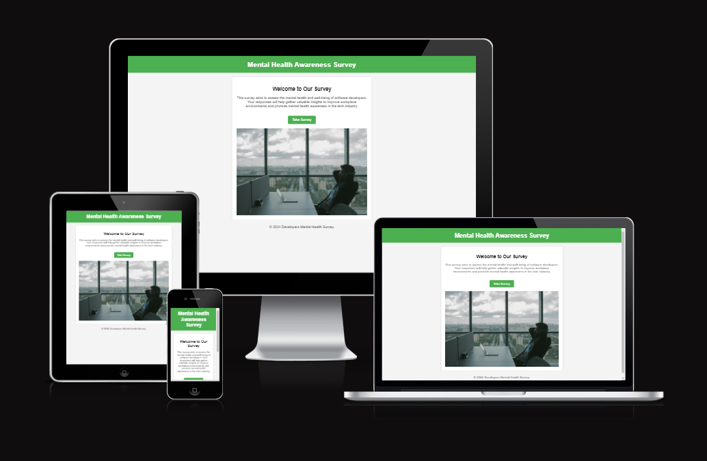
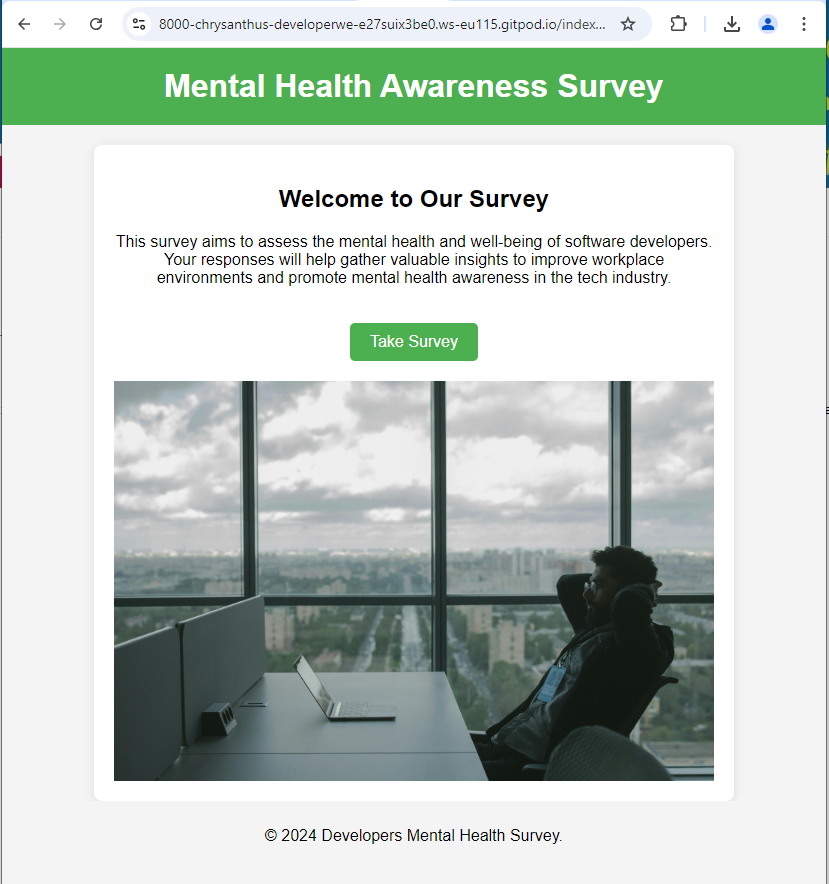
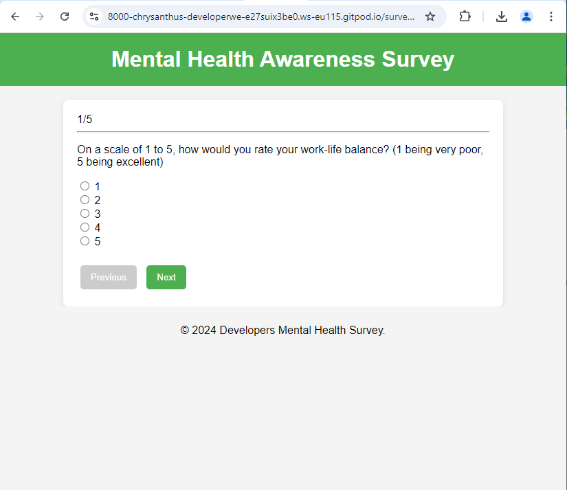
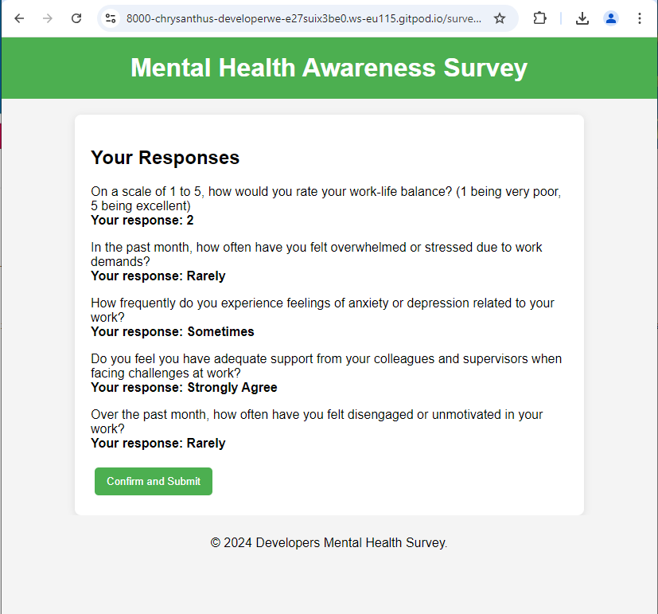
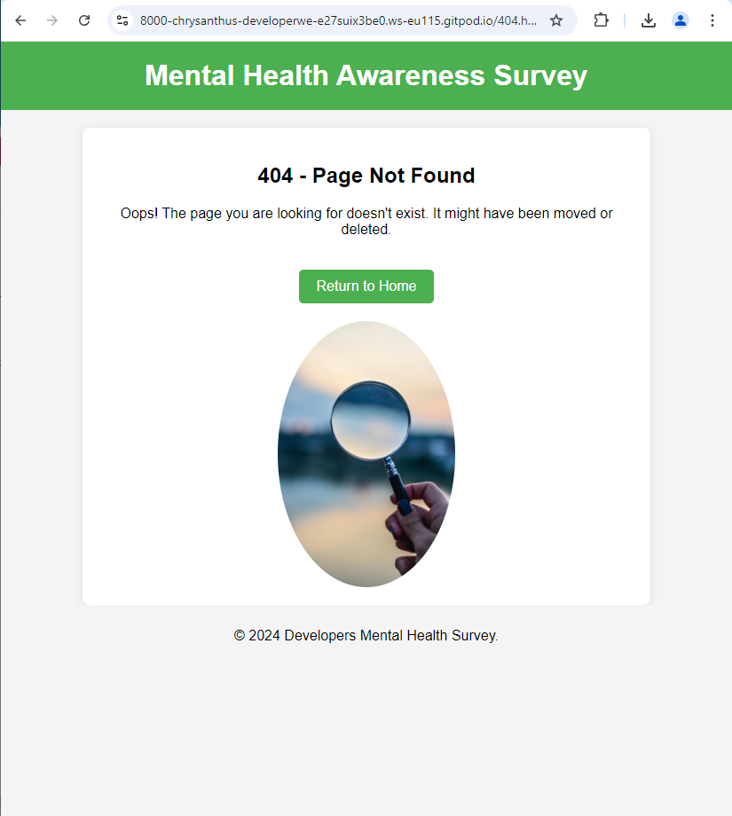
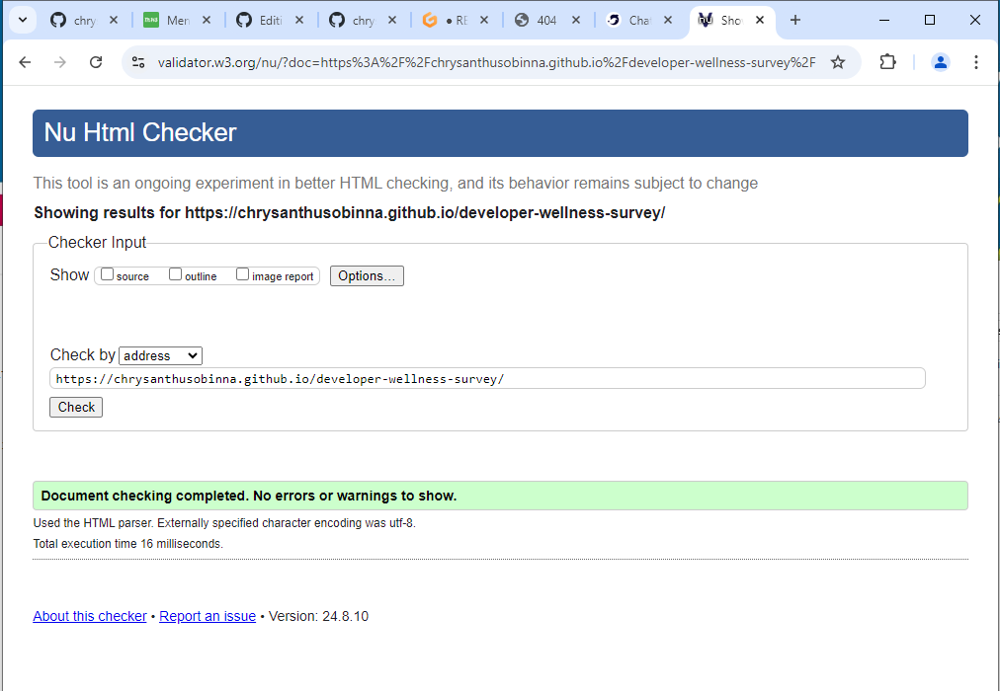
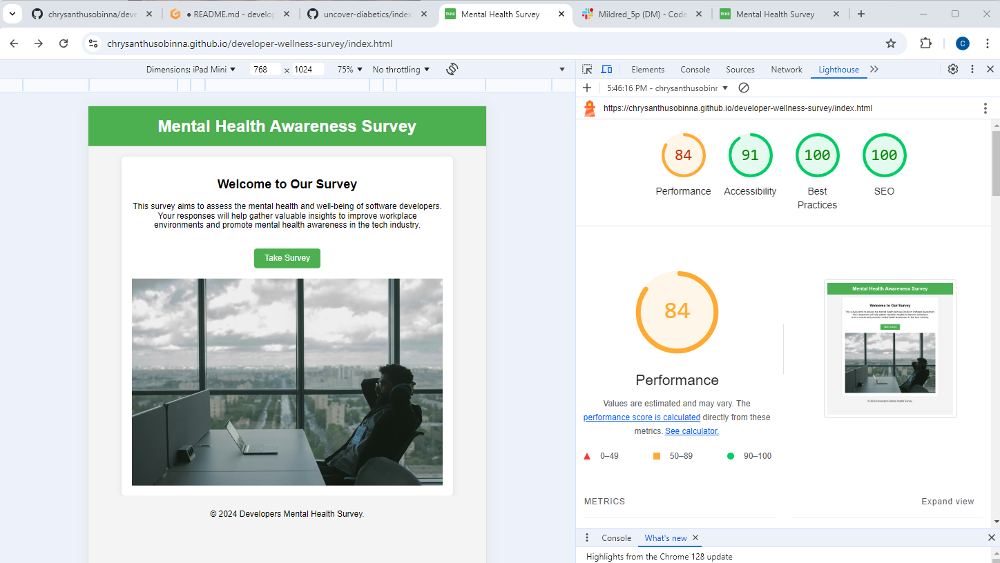

# Mental Health Awareness Survey


## Overview

The **Mental Health Awareness Survey** is a web-based application designed to gather information and increase awareness about mental health issues. It aims to provide users with an opportunity to express their views and experiences related to mental health, contributing to a broader understanding and fostering community support.

The application consists of four primary pages:
- `index.html`: The homepage of the survey, providing an overview and introduction.
- `survey.html`: The main page where users can fill out the mental health survey.
- `confirm.html`: A confirmation page that appears after survey submission.
- `404.html`: An error page for handling incorrect URLs.



## UX

#### Color Scheme

- **Background Color:** The background color of the website is #f4f4f4, providing a soft and neutral canvas that enhances readability and aesthetic appeal.
- **Page Header Color:** The page header is styled with a vibrant green (#4CAF50), symbolizing growth, health, and a refreshing atmosphere. This color choice is ideal for a platform focused on health awareness and education.

#### Typography

- **Font:** The font used throughout the website is `Arial, sans-serif`. This font choice ensures readability across different devices and provides a clean, modern look to the content.

## Features

### Existing Features

- **Homepage (index.html)**  
  Provides an overview of the survey and its purpose. This page introduces users to the survey and guides them on how to proceed.

  

- **Survey Page (survey.html)**  
  Allows users to participate in the survey by answering a series of questions related to mental health.

  

- **Confirmation Page (confirm.html)**  
  Displays a confirmation message after users complete the survey, thanking them for their participation.

  

- **Error Page (404.html)**  
  Provides a user-friendly error message when a page is not found.

  


### Features Left to Implement

- **Email Notification System**: Develop the backend code to facilitate email notifications that will be triggered upon the successful submission of the survey form. This feature will ensure that users receive a confirmation of their submission and any additional relevant information.

- **Personalized User Recommendations**: Implement a function that analyzes the user responses from the survey and generates tailored advice or suggestions. This will enhance user engagement by providing customized feedback based on individual inputs and preferences.


## Testing 

I conducted thorough testing of each page using various tools to ensure the website functions correctly and meets quality standards.
#### Index Page:

- **HTML Validator:** The HTML structure was validated using W3C HTML Validator. The result was "Document checking completed. No errors or warnings to show."
  

- **Google Chrome Lighthouse:** The Index page was tested with Google Chrome Lighthouse.

Performance: 62, 
Accessibility: 91, 
Best Practices: 100, 
SEO: 91. 

Here is a screenshot of the result:
  


## Tools & Technologies Used

- [](https://en.wikipedia.org/wiki/HTML) - Used for structuring the web pages.
- [](https://en.wikipedia.org/wiki/CSS) - Used for styling the web pages.
- [](https://www.javascript.com) - Used for interactive elements.
- [](https://pages.github.com) - Used for hosting the deployed site.

## Deployment

The site is deployed on GitHub Pages. To deploy the site, follow these steps:

1. Navigate to the [GitHub repository](https://github.com/yourusername/mental-health-awareness-survey) and go to the Settings tab.
2. In the "Pages" section, select the **Main** branch as the source and save the settings.
3. The page will be automatically updated to reflect the changes.

The live site can be accessed [here](https://yourusername.github.io/mental-health-awareness-survey).

### Local Deployment

To run the project locally, follow these steps:

#### Cloning

1. Visit the [GitHub repository](https://github.com/yourusername/mental-health-awareness-survey).
2. Click the "Code" button and copy the URL for cloning.
3. Open Git Bash or Terminal and run:
   ```bash
   git clone https://github.com/yourusername/mental-health-awareness-survey.git
   ```
4. Navigate to the project directory and open the HTML files in a browser.

Alternatively, you can use [Gitpod](https://gitpod.io) to create an online workspace:

[](https://gitpod.io/#https://github.com/yourusername/mental-health-awareness-survey)

#### Forking

To fork the repository:

1. Log in to GitHub and go to the [repository page](https://github.com/yourusername/mental-health-awareness-survey).
2. Click the "Fork" button at the top-right corner of the page.

## Credits

**Media**

* The photos used on the Home Page, About Page, and Contact Page are from [Pexels](https://www.pexels.com/).

**Mentor Support**

I would like to express my gratitude to my mentor for their invaluable support throughout this project. They shared best practices and guidelines that significantly improved my approach to the design and development of this project. 