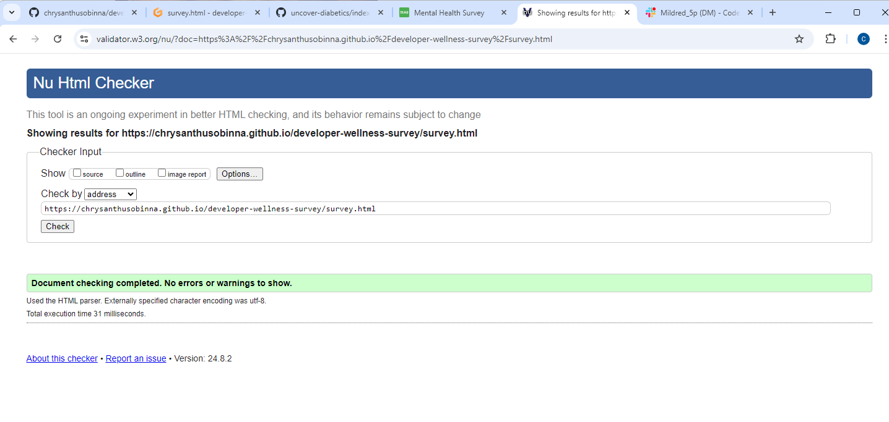
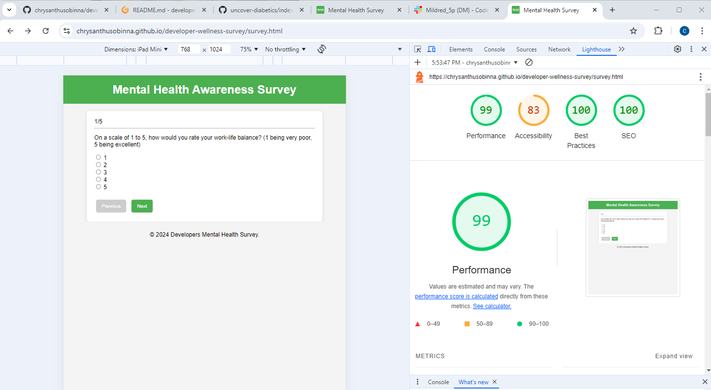
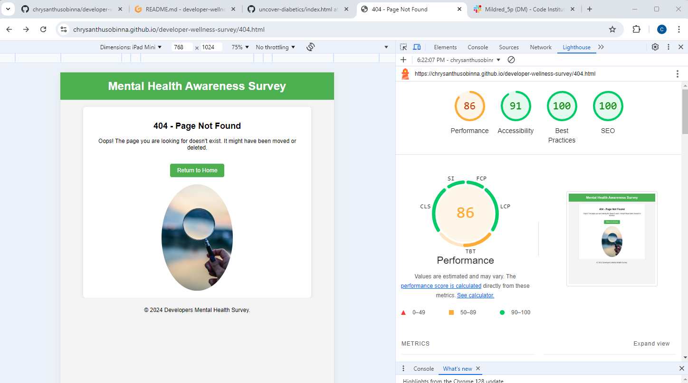

# Mental Health Awareness Survey


## Overview

The **Mental Health Awareness Survey** is a web-based application designed to gather information and increase awareness about mental health issues. It aims to provide users with an opportunity to express their views and experiences related to mental health, contributing to a broader understanding and fostering community support.

 
## Tools & Technologies Used

- [](https://en.wikipedia.org/wiki/HTML) - Used for structuring the web pages.
- [](https://en.wikipedia.org/wiki/CSS) - Used for styling the web pages.
- [](https://www.javascript.com) - Used for interactive elements.
- [](https://jquery.com) - Used for simplifying DOM manipulation and event handling.
- [](https://pages.github.com) - Used for hosting the deployed site.


The application consists of four primary pages:
- `index.html`: The homepage of the survey, providing an overview and introduction.
- `survey.html`: The main page where users can fill out the mental health survey.
- `confirm.html`: A confirmation page that appears after survey submission.
- `404.html`: An error page for handling incorrect URLs.


## UX

#### Color Scheme

- **Background Color:** The background color of the website is #f4f4f4, providing a soft and neutral canvas that enhances readability and aesthetic appeal.
- **Page Header Color:** The page header is styled with a vibrant green (#4CAF50), symbolizing growth, health, and a refreshing atmosphere. This color choice is ideal for a platform focused on health awareness and education.

#### Typography

- **Font:** The font used throughout the website is `Arial, sans-serif`. This font choice ensures readability across different devices and provides a clean, modern look to the content.

## Features

### Existing Features

- **Homepage (index.html)**  
  Provides an overview of the survey and its purpose. This page introduces users to the survey and guides them on how to proceed.

  

- **Survey Page (survey.html)**  
  Allows users to participate in the survey by answering a series of questions related to mental health.

  

- **Confirmation Page (confirm.html)**  
  Displays a confirmation message after users complete the survey, thanking them for their participation.

  

- **Error Page (404.html)**  
  Provides a user-friendly error message when a page is not found.

  


### Features Left to Implement

- **Email Notification System**: Develop the backend code to facilitate email notifications that will be triggered upon the successful submission of the survey form. This feature will ensure that users receive a confirmation of their submission and any additional relevant information.

- **Personalized User Recommendations**: Implement a function that analyzes the user responses from the survey and generates tailored advice or suggestions. This will enhance user engagement by providing customized feedback based on individual inputs and preferences.


## Testing 

I conducted thorough testing of each page using various tools to ensure the website functions correctly and meets quality standards.
#### Index Page:

- **HTML Validation**: The HTML structure of the project has been rigorously validated using the W3C HTML Validator. The validation outcome was successful, with the message: "Document checking completed. No errors or warnings to show." This ensures compliance with web standards and improves cross-browser compatibility.
  
  

- **Performance Audit with Google Chrome Lighthouse**: The Index page underwent testing using Google Chrome Lighthouse, which assesses various aspects of web applications.

  - **Performance**: 62 - While there is room for improvement, this score reflects a functional user experience.
  - **Accessibility**: 91 - This high score indicates strong adherence to accessibility best practices, making the site usable for individuals with disabilities.
  - **Best Practices**: 100 - A perfect score, signifying that the site follows industry best practices in web development.
  - **SEO**: 91 - This score highlights effective search engine optimization strategies, ensuring better visibility in search results.

  Below is a screenshot of the audit results for reference:
  
  


#### Survey Page:

- **HTML Validation:** The HTML structure of the Survey Page was thoroughly validated using the W3C HTML Validator. The validation result confirmed that the document is free of errors and warnings: **"Document checking completed. No errors or warnings to show."**
  
  

- **Google Chrome Lighthouse Assessment:** The Survey Page underwent a comprehensive analysis using Google Chrome Lighthouse, which evaluates various aspects of web pages, including performance, accessibility, best practices, and SEO.

  - **Performance:** 92  
  - **Accessibility:** 83  
  - **Best Practices:** 100  
  - **SEO:** 90  

  Below is a screenshot showcasing the Lighthouse assessment results for the Survey Page:

  


#### Confirm Page:

- **HTML Validation:** The HTML structure of the Confirm Page was meticulously validated using the W3C HTML Validator. The validation result showcases the quality of the code: **"Document checking completed. No errors or warnings to show."**

  

- **Google Chrome Lighthouse Evaluation:** A comprehensive assessment of the Confirm Page was conducted using Google Chrome Lighthouse, a powerful tool that evaluates crucial performance metrics, accessibility, best practices, and search engine optimization (SEO).

  - **Performance:** 50 – While there is room for improvement, this score highlights the need for optimizations to enhance the user experience and loading times.
  - **Accessibility:** 91 – A commendable score demonstrating strong design principles that ensure inclusivity for all users.
  - **Best Practices:** 100 – An exemplary score reflecting adherence to web development best practices, ensuring security and reliability.
  - **SEO:** 91 – A strong score indicating effective search engine optimization strategies in place, contributing to better visibility in search engine results.

  Below is a screenshot that captures the Lighthouse assessment results for the Confirm Page:

  

 
 
### 404 Page

#### HTML Validation 
To ensure a robust and error-free structure, the HTML of the 404 page was meticulously validated using the **W3C HTML Validator**. The validation was successful, yielding the following result: 

> **Document checking completed. No errors or warnings to show.**


This clean validation reinforces the importance of adhering to web standards, promoting both performance and accessibility.

#### Google Chrome Lighthouse Audit
In addition to HTML validation, the 404 page underwent a comprehensive performance audit using **Google Chrome Lighthouse**. Below are the scores achieved in key areas, along with remarks:

- **Performance:** 86 – While there is room for improvement, this score highlights the need for optimizations to enhance the user experience and loading times. Strategies such as minimizing render-blocking resources and optimizing images could further improve this score.

- **Accessibility:** 91 – A commendable score demonstrating strong design principles that ensure inclusivity for all users. The page successfully addresses many accessibility standards, but there's potential for further enhancements, like improving color contrast and keyboard navigation.

- **Best Practices:** 100 – An exemplary score reflecting adherence to web development best practices, ensuring security and reliability. This perfect score indicates a robust and secure coding methodology.

- **SEO:** 91 – A strong score indicating effective search engine optimization strategies in place, contributing to better visibility in search engine results. Continued focus on refining metadata and keyword usage could push this score even higher.

Here is a screenshot of the Lighthouse audit results:

 


I conducted testing on all features, including the survey form, links, and responsive design. The website was also evaluated across various browsers (Chrome, Firefox, Safari) and different screen sizes (desktop, tablet, and mobile) using Google Chrome Developer Tools.

### Responsive Design Testing

To verify the website's responsiveness, I utilized Google Chrome Developer Tools to emulate various devices. Below are the details of the tests conducted:

- **Mobile Phone**
  - Tested on a mobile phone using Chrome Developer Tools.
  - 

- **iPad**
  - Tested on an iPad using Chrome Developer Tools.
  - 

- **Desktop**
  - Tested on a desktop.
  - 


### Survey Form Testing

I conducted thorough manual testing of the survey form’s response and submission processes, ensuring that users receive a confirmation message upon submission and that their input is successfully sent to us. The survey form submits data to "confirm.html" using the POST method.

Below is a screenshot showcasing the survey form and the successful submission of the survey form:


#### CSS Validation

To ensure the quality and correctness of the CSS code for the website, I utilized the [CSS Validator](https://jigsaw.w3.org/css-validator/) tool. This tool is instrumental in checking the syntax and compliance of CSS against web standards. 

Upon validation, the results were exceptional: **"Congratulations! No Error Found."** This indicates that the CSS code is free of errors and adheres to best practices, contributing to a robust user experience.


By maintaining valid CSS, I aimed to enhance the website's compatibility across different browsers and devices, ensuring a consistent and visually appealing layout for all users.


#### JavaScript/jQuery Testing

To ensure the quality and functionality of the JavaScript code, I conducted a thorough assessment using [JSHint](https://jshint.com/). This tool provides a robust analysis of JavaScript code to identify potential issues and maintain best practices.

The following metrics were reported for the JavaScript file:

- **Total Functions:** 9 functions
- **Function with the Largest Signature:** Takes 1 argument
- **Median Function Signature:** 0 arguments
- **Largest Function Statement Count:** 10 statements
- **Median Function Statement Count:** 3 statements
- **Most Complex Function Cyclomatic Complexity:** 3 
- **Median Cyclomatic Complexity:** 1

These metrics give insights into the structure and complexity of the code, allowing for more informed decisions on refactoring and optimization.

  <!-- Replace with the actual path to your screenshot -->


During my testing with Google Chrome Developer Tools, I encountered an error in the console, which pointed to a malfunction in the year display at the bottom of each webpage. The issue stemmed from my implementation of JavaScript in the `script.js` file, where I was using JavaScript to dynamically output the current year. To resolve this, I separated the line responsible for retrieving the current year, `document.getElementById('currentYear').textContent = new Date().getFullYear();`, from the jQuery code in `script.js`. I then created a new file, `date.js`, to contain this function, which successfully rectified the issue.

Despite these minor setbacks, I am confident that our website offers a user-friendly and efficient way for visitors to access the information they need. We believe that our site meets all the requirements outlined in the project brief and is ready for launch.
 


## Deployment

The site is deployed on GitHub Pages. To deploy the site, follow these steps:

1. Navigate to the [GitHub repository](https://github.com/yourusername/mental-health-awareness-survey) and go to the Settings tab.
2. In the "Pages" section, select the **Main** branch as the source and save the settings.
3. The page will be automatically updated to reflect the changes.

The live site can be accessed [here](https://yourusername.github.io/mental-health-awareness-survey).

### Local Deployment

To run the project locally, follow these steps:

#### Cloning

1. Visit the [GitHub repository](https://github.com/yourusername/mental-health-awareness-survey).
2. Click the "Code" button and copy the URL for cloning.
3. Open Git Bash or Terminal and run:
   ```bash
   git clone https://github.com/yourusername/mental-health-awareness-survey.git
   ```
4. Navigate to the project directory and open the HTML files in a browser.

Alternatively, you can use [Gitpod](https://gitpod.io) to create an online workspace:

[](https://gitpod.io/#https://github.com/yourusername/mental-health-awareness-survey)

#### Forking

To fork the repository:

1. Log in to GitHub and go to the [repository page](https://github.com/yourusername/mental-health-awareness-survey).
2. Click the "Fork" button at the top-right corner of the page.

## Credits

**Media**

* The photos used on the Home Page, About Page, and Contact Page are from [Pexels](https://www.pexels.com/).
* The favicon for this project was sourced from [Favicon.io](https://favicon.io/).

**Mentor Support**

I would like to express my gratitude to my mentor for their invaluable support throughout this project. They shared best practices and guidelines that significantly improved my approach to the design and development of this project.